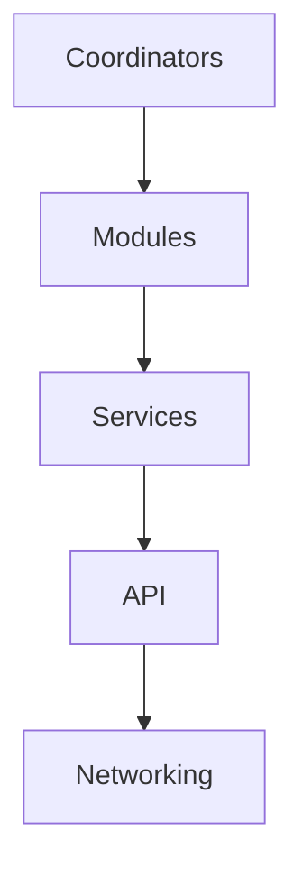
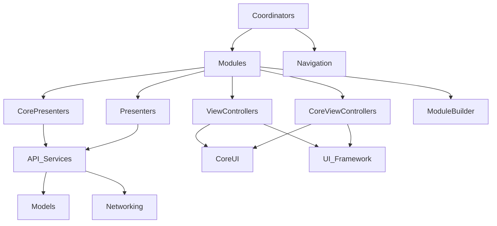

### Data Flow 

- Coodinators only can have temporary data to make full flow
- Presenters of module can have inside services which provide him a full module data
- Services can use pubilc networking api off app
- API use networking layer. API class also can be singleton
- Imdependent part of programm

### Dependency Flow

[See also in figma](https://www.figma.com/file/DJTcK2QskNcJqHGOc7jO72/layer-based-architercture?node-id=0%3A1&t=ga5c0Q0v115XXLgg-1)

